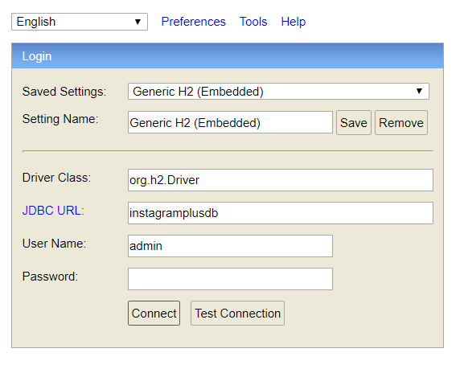

# Software Engineering 2020 - Back-end

## API

---

### Registation

- [Accounts Documentacion](doc/API/Registation.md)

### Authentication

- [Accounts Documentacion](doc/API/Authenticator.md)

### Accounts

- [Accounts Documentacion](doc/API/Accounts.md)

### Messages

- [Messages Documentacion](doc/API/Messages.md)

### Publications

- [Publications Documentacion](doc/API/Publications.md)

---

## Base de dados

**URL:** http://localhost:8080/h2

---
