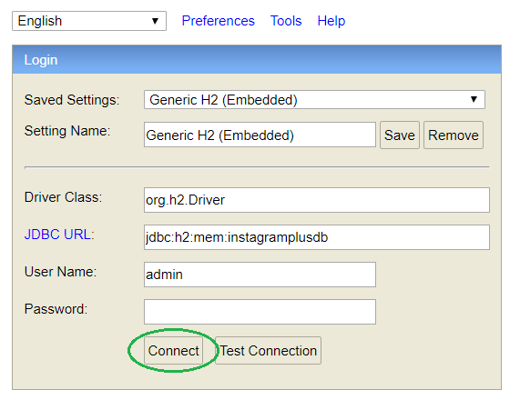

# Software Engineering 2020

Instagram Plus Project

---

## Tecnologias

### Back-end - [Readme.md](Back-end/README.md)

- [Spring-boot 2.2.7](https://start.spring.io/)
- [Maven](https://maven.apache.org/)
- [Java 8](https://www.java.com/)
- [H2 Data Base Engine](https://www.h2database.com/html/main.html)
- [JSON Web Tokens(JWT)](https://jwt.io/)

### Front-end - [Readme.md](Front-end/README.md)

---

## Base de dados

**URL:** http://localhost:8080/h2




---

## Começar

### Instalação de dependências

TODO

### Correr back-end

TODO

### Correr front-end

TODO

---

## Utils

### Comandos Git

```bash
https://github.com/rfa-lopes/SS-TP1.git
git pull origin master
git add .
git commit -m "Initial commit"
git push
git rm -r --cached Path/to/directories
```

## Informação adicional

### Autores

- Rodrigo Lopes - rfa.lopes@campus.fct.unl.pt - 50435
- Miguel Fernandes - mia.fernandes@campus.fct.unl.pt - 50487
- Bárbara Lopes - bi.lopes@campus.fct.unl.pt - 51104
- Fábio Cunha - ff.cunha@campus.fct.unl.pt - 50613

### Professor

- João Araújo

### Turnos práticos

- P1
- P4
